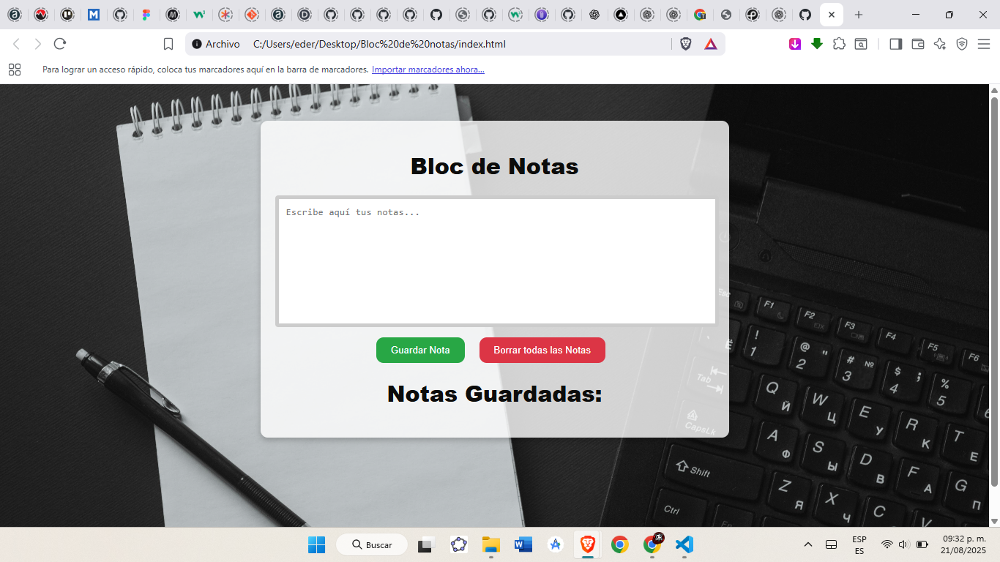

# 📝 Bloc de Notas en JavaScript

Un **Bloc de Notas** simple hecho con **HTML, CSS y JavaScript**.  
Permite escribir, guardar y eliminar notas que se almacenan en el navegador usando **LocalStorage**, de manera que no se pierden al recargar la página.

---

## 🚀 Características

- ✍️ Escribir y guardar notas fácilmente.  
- 💾 Las notas se almacenan en el navegador (**LocalStorage**).  
- 🗑️ Posibilidad de eliminar notas individualmente.  
- 🔥 Botón para borrar todas las notas con un solo clic.  
- 📅 Cada nota incluye la **fecha y hora** en que fue guardada.  
- 🎨 Interfaz moderna y responsiva con un fondo atractivo.  

---

## 🛠️ Tecnologías utilizadas

- **HTML5** → estructura de la aplicación.  
- **CSS3** → estilos con efectos modernos (blur, hover, sombras).  
- **JavaScript (Vanilla JS)** → lógica para guardar, mostrar y eliminar notas.  
- **LocalStorage** → almacenamiento local de notas en el navegador.  

---

## 📂 Estructura del proyecto

📦 Bloc-de-Notas
├── index.html # Página principal
├── style.css # Estilos del bloc de notas
├── f.js # Lógica en JavaScript
└── asset/ # Carpeta de imágenes (fondo)


---

## ▶️ Cómo usarlo

1. Clona este repositorio o descarga los archivos.
   ```bash
   git clone https://github.com/frankederf/bloc-de-notas.git

2.  Abre el archivo index.html en tu navegador. 

3. Escribe una nota en el cuadro de texto y presiona Guardar Nota.

4. Tus notas se mostrarán en la lista y se guardarán automáticamente en el navegador.

## 📸 Captura de pantalla



**Vista previa del Bloc de Notas**

👨‍💻 Autor

Desarrollado por Frank Flores
© 2025 - Todos los derechos reservados.